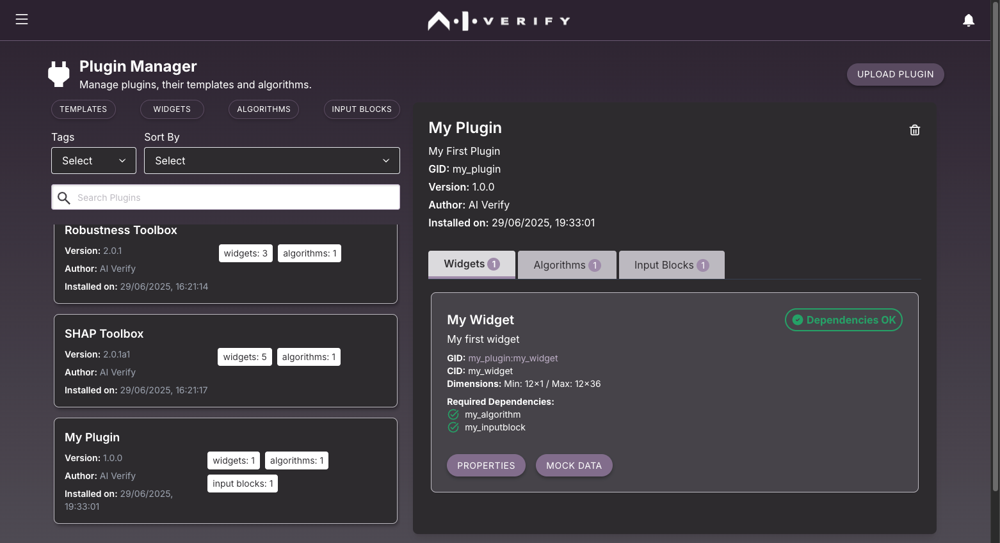
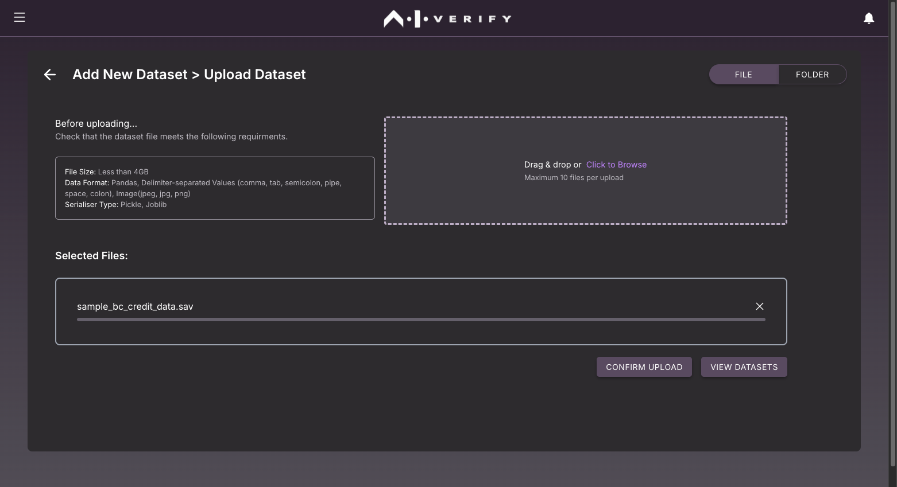

# Deploy Your Plugin

Now that you have created your plugin component(s), it is time to package it into a single plugin for deployment.

If you are following the guided example, you should have the following components completed and packaged in its own respective folders:

1. my_algorithm component
2. my_inputblock component
3. my_widget component

## Combine the plugin components

The **my_plugin** directory should mimic the same plugin structure. The `algorithms` directory should contain algorithms, with each one in its own respective folder. The widget components will be stored in the `widgets` directory and input blocks will be stored in the `inputs` directory..


## Edit Plugin Details (Optional)

You may wish to edit *plugin.meta.json* to change the plugin details.

```py title="plugin.meta.json" linenums="1" hl_lines="2 3 4 5 6"
{
  "gid": "my_plugin",
  "name": "My Plugin",
  "version": "1.0.0",
  "description": "My First Plugin",
  "author": "AI Verify"
}
```

## Deploy your Plugin

You can package your plugin using the [`aiverify-plugin zip`](../plugins/Plugin_Tool.md#zip) command.

```bash
# Execute this command under the my_plugin directory
aiverify-plugin zip
```

!!! note
    A new folder `dist` will be created. This folder is where the packaged `.zip` file will be created and placed.

Verify that the zip file ```my_plugin-1.0.0.zip``` exists in your `dist` directory:

The resulting plugin is packaged as a `zip` file, which can be used to share with other developers who are interested in using your plugin. Users and developers can then upload the zip file onto AI Verify through the plugin manager and use it in the report.

## Uploading the plugin

To upload the plugin, start the frontend portal of AI Verify. You will need to install AI Verify if you have not done so. The instructions to install and run AI Verify from source code can be found in the [User Guide](https://imda-btg.github.io/aiverify/getting-started/source-code-setup/).

1. Once the portal is started up, visit the portal at [http://localhost:3000/home](http://localhost:3000/home). In the homepage, click on **Manage** -> **Plugins** to visit the **Plugin Manager** page:
    

2. In the **Plugin Manager** page, click on "UPLOAD PLUGIN" at the top right. Then either drag and drop `my_plugin-0.1.0.zip` to the file selector or click to browse and select the zip file. Then click "CONFIRM UPLOAD" to upload the plugin:
    

3. The following prompt should appear to inform you that the plugin has been installed successfully: 
    

4. Click the back arrow key to return to the **Plugin Manager** page. You should see your plugin in the list of installed plugins:
    

## Upload the Test Datasets and Models

Select and upload the dataset, ground truth dataset and model. You can download the test dataset and model from the [AI Verify Github Repository](https://github.com/aiverify-foundation/aiverify/tree/main/stock-plugins/user_defined_files). 

1. From the Homepage, select **Manage** -> **Models** page and then click the **UPLOAD MODEL** button.

2. Select the **Upload AI Model** to upload a model file and click "Next".
   

3. Drag and drop `sample_bc_credit_sklearn_linear.LogisticRegression.sav` to the upload file selector, or click to browse and select the file. The filename `sample_bc_credit_sklearn_linear.LogisticRegression.sav` should appear on the selected file list. Select `Classification` next to the file name and click **UPLOAD FILES(S)** to upload the file.
   

4. Once the file has been uploaded, click the back arrow `<-` twice to return the model list page. You should now see the uploaded model appear in the list.
   

5. From the Homepage, select **Manage** -> **Data** page and then click the **UPLOAD DATASET** button.

6. Drag and drop `sample_bc_credit_data.sav` to the upload file selector, or click to browse and select the file. The filename `sample_bc_credit_data.sav` should appear on the selected file list. Click **CONFIRM UPLOAD** to upload the file.
   

7. Once the file has been uploaded, click the back arrow `<-` once to return the dataset list page. You should now see the uploaded dataset appear in the list.
   

## Generating the Report

1. It is time to run the plugin. In the homepage, click on "Create New Project":
   

2. Fill in the project details and click "Next" on the top right:
   

3. In the Report Template Selection page, Click **Create New Report Template** to create a report from scratch.
   

4. On the **Design Report** page, drag your widget from the left panel to the canvas:
   
   Since the widget is a **dynamic height** widget, the widget height will expand dynamically to fill to the bottom of the canvas. Click on the algorihm and input block dependencies icon to view the list of dependencies for this widget. When you're ready, click "Next" on the bottom right.

5. On the **Select the Mode, Test Results and User Input** page, Click the **RUN TESTS** button besides **My Algorithm** to run the test for the algorithm.
   

6. Select the model and test datasets upload. Then enter the algorithm parameters. Refer to the following table for reference.

    | Data, Model, and Test Arguments | Selected Dataset / Model / Test Arguments |
    | ---- | ---------- |
    | Model | ```sample_bc_credit_sklearn_linear.LogisticRegression.sav``` | 
    | Testing Dataset | ```sample_bc_credit_data.sav``` |
    | Ground Truth Dataset | ```sample_bc_credit_data.sav``` |
    | Ground Truth Column | ```default``` |
    | Feature Name | ```gender``` |

    
    Click **Run Test** button to run the test.

8. When you are ready, click on **Run Test** button on the bottom right to run the test.

9. You should see the list of tests that are running or have previously been run from the portal. When the algorithm is running, it's status is **PENDING**. Once the **My Algorithm** has completed running, it's status will be reflected as **SUCCESS** or **ERROR**.
    
    !!! note
        If the algorithms is unable to run due to error, the status will be set to **ERROR** and you can view the error log by clicking the **View Error** button.

10. Click the **Back to Project** button on the top left to return to the project. Now click the **ADD INPUT** button to enter the user input for **My Input Block**. Enter a name for this input and then some values in the **First name** and **Last name** fields.

    Click the **Submit** button on the bottom right to create a new input.

    

11. Now from the **Select the Mode, Test Results and User Input** page, select the **AI Model** and the newly created **Test Results** and **User Inputs**. 
   

12. Click the **Next** button on the bottom right to view the web report.
    
   
Congratulations! You have generated your first report. 