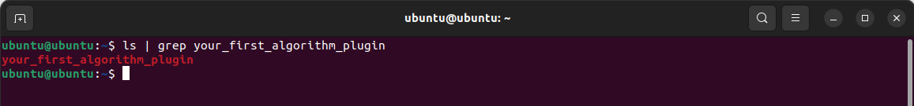

# Building your first algorithm component

You will be building a plugin to take in a feature value from the user and print out the value in a generated report report. This plugin requires two type of components: **algorithm** and **widget** (See [this page](../introduction_to_plugins) for more details on *Plugins*). 

## Creating your first algorithm component

There are three objectives in this algorithm component:

1. Modify the input schema so that the algorithm can receive input from user
2. Modify the output schema and codes to return expected output
3. Modify the testing codes

First, let's create a new algorithm project. If you haven't setup your environment, [follow the instructions on this page](../../getting_started/install_aiverify_dev_tools) before continuing.

## Generating the project

From your terminal, use `cookiecutter` to download the base `algorithm` folder for your new algorithm.

```bash
# From the aiverify-developer-tools project directory
cd template_plugin

# Create algorithms folder if it doesn't already exist
mkdir -p algorithms

cd algorithms

cookiecutter ../../ai-verify-algorithm-template
```

Answer the following questions:

| Required Input | Action |
| ---- | ---------- |
| author [example_author] | We will use the default. *Press Enter.* |
| plugin_name [example plugin] | Type ```your-first-algorithm-plugin```. *Press Enter.* |
| Choose from 1 [1] | We will use the default. *Press Enter.* |
| plugin_version [0.1.0] | We will use the default. *Press Enter*  |
| plugin_description [My example plugin] | Type ```Your first algorithm plugin```.*Press Enter*  |
| plugin_url [https://pypi.org/project/example_plugin/] | We will use the default. *Press Enter*  |
| Select license [1] | We will use the default. *Press Enter*  |
| Select algo_model_support [1] | We will use the default. *Press Enter* |
| Select require_ground_truth [1] | We will use the default. *Press Enter* |

!!! note
    The plugin name ```your-first-algorithm-plugin``` will automatically be converted to ```your_first_algorithm_plugin```. The cookiecutter generator will automatically convert the name to create the project slug. Refer to the [guide](https://peps.python.org/pep-0008/#package-and-module-names) on **Package and Module Names**.

Verify that the directory ```your_first_algorithm_plugin``` exists in your current directory:

```bash
ls | grep your_first_algorithm_plugin
```


If you do not see the project name, something in the setup is incomplete. Please re-create the project directory through the steps above again.

Yay! You have generated a project to create your first algorithm (See more details at [Understanding your algorithm project](../plugins/algorithm/file_structure.md))

## Modifying input schema

Modify `input.schema.json` to request an input called `feature_name` from the user when the user uses this algorithm. Notice the highlighted lines that requires a `feature_name` field, and the properties of the `feature_name` is also defined.

```py title="input.schema.json" linenums="1" hl_lines="8 11 12 13 14 15"
{
    "$schema": "https://json-schema.org/draft/2020-12/schema",
    "$id": "https://pypi.org/project/example_plugin//input.schema.json",
    "title": "Algorithm Plugin Input Arguments",
    "description": "A schema for algorithm plugin input arguments",
    "type": "object",
    "required": [
        "feature_name"
    ],
    "properties": {
        "feature_name": {
            "title": "Feature Name",
            "description": "Indicate the feature name to be extracted from the data file",
            "type": "string"
        }
    }
}
```

## Modifying algorithm

Modify `your_first_algorithm_plugin.py` to receive and return the data of the requested `feature_name`. 

!!! Tip
    All codes generated using our `cookiecutter` template has annotated with `TODO:` to for users to quickly navigate to areas that require code modification.

First, update the description of this algorithm in the code.

```py title="your_first_algorithm_plugin.py" linenums="23" hl_lines="3 4 9"
class Plugin(IAlgorithm):
    """
    # TODO: Update the plugin description below
    The Plugin(your-first-algorithm-plugin) class specifies methods in generating results for algorithm
    """

    # Some information on plugin
    _name: str = "your-first-algorithm-plugin"
    _description: str = "This algorithm returns the value of the feature name selected by the user."
    _version: str = "0.1.0"
    _metadata: PluginMetadata = PluginMetadata(_name, _description, _version)
    _plugin_type: PluginType = PluginType.ALGORITHM
    _requires_ground_truth: bool = False
```

Next, update the `generate` method to retrieve the return the values of the selected `feature_name` in a given sample data file.

```py title="your_first_algorithm_plugin.py" linenums="167" hl_lines="8 10 13 14 15"
    def generate(self) -> None:
        """
        A method to generate the algorithm results with the provided data, model, ground truth information.
        """
        # Retrieve data information
        self._data = self._data_instance.get_data()

        # TODO: Insert algorithm logic for this plug-in.
        # Retrieve the input arguments
        my_user_defined_feature_name = self._input_arguments['feature_name']

        # Get the values of the feature name and convert to a list.
        self._results = {
            "my_expected_results": list(self._data[my_user_defined_feature_name].values)
        }

        # Update progress (For 100% completion)
        self._progress_inst.update(1)
```

Lastly, update the `output.scheme.json` to return the expected results. This file will be validated against the output to ensure that the results (see line 180 in the previous code snippet) adhere to the output schema.

In this algorithm, the expected output will be stored in a list (or array) named `my_expected_results`.  There must be at least 10 items in the list, and the items must have the type `number` (as shown in the highlighted lines).

```py title="output.schema.json" linenums="1" hl_lines="7 10 11 12 13 14"
{
    "$schema": "https://json-schema.org/draft/2020-12/schema",
    "$id": "https://pypi.org/project/example_plugin//output.schema.json",
    "title": "Algorithm Plugin Output Arguments",
    "description": "A schema for algorithm plugin output arguments",
    "type": "object",
    "required": ["my_expected_results"],
    "minProperties": 1,
    "properties": {
        "my_expected_results": {
            "description": "Algorithm Output",
            "type": "array",
            "minItems": 10,
            "items": {"type": "number"}
        }
    }
}
```
## Run the test

First, update `__main__.py` with your sample data, model and ground truth files required for your algorithm to run.

In this algorithm, we have updated the `data_path`, `model_path`, `ground_truth_path` to the path of the files. The `ground_truth` has also been set to default. We have also updated the `plugin_argument_values` with required arguments to ensure that the input validation passes. This is typically an input parameter from the dataset. For the mock data, we will be using *gender* as the plugin argument value.

If you created the algorithm component with cookiecutter, you only need to point the core_modules_path to the **test-engine-core-modules** folder in step 1 of the [Installing AI Verify Developer Tools](../getting_started/install_aiverify_dev_tools.md) page. 

```py title="__main__.py" linenums="1" hl_lines="12 13 14 15 16 17 26"
from tests.plugin_test import PluginTest

if __name__ == "__main__":
    # TODO: Define data, model, ground_truth file location. Requires absolute path.
    #       Define core modules path as relative/absolute path. If you cloned the project using 
    #       the provided setup script, leave core_modules_path as an empty string.
    # Example:
    # data_path = "tests/user_defined_files/data/pickle_pandas_mock_binary_classification_credit_risk_testing.sav"
    # model_path = "tests/user_defined_files/model/binary_classification_mock_credit_risk_sklearn.linear_model._logistic.LogisticRegression.sav"
    # ground_truth = "default"
    # model_type = ModelType.CLASSIFICATION
    core_modules_path = "<working directory>/aiverify/test-engine-core-modules"
    data_path = "tests/user_defined_files/data/pickle_pandas_mock_binary_classification_credit_risk_testing.sav"
    model_path = "tests/user_defined_files/model/binary_classification_mock_credit_risk_sklearn.linear_model._logistic.LogisticRegression.sav"
    ground_truth_path = "tests/user_defined_files/data/pickle_pandas_mock_binary_classification_credit_risk_testing.sav"
    ground_truth = "default"
    model_type = ModelType.CLASSIFICATION
    run_pipeline = False

    # TODO: Define the plugin input parameters value referenced from input.schema.json
    # Example:
    # plugin_arguments_value = {
    #     "argument1": "MyArgumentValue"
    # }
    plugin_argument_values = {
        "feature_name": "gender"
    }
```

!!! Note
    Ground truth is optional so if your algorithm does not require ground truth, `ground_truth_path` and `ground_truth` can be left as an empty string `""`.

Next, run `python` to test your algorithm.

```bash
python .
```

If the test passes (no error messages in terminal), you have successfully completed the creation of the algorithm component. At this stage, you can either [**deploy your algorithm component**](#deploy-your-algorithm-component) as a standalone plugin, or continue to [**work on other components**](./your_first_widget.md) (eg. another algorithm, widget, input block etc) before packaging it as a single plugin.

If the test fails, refer to the troubleshooting guide for help.

## Deploy your algorithm component

We have provided a script to help deploy your algorithm plugin by packaging it. If you have not created a widget component at this point, this will package the algorithm as a standalone plugin. To run the script, navigate to the directory with the script `deploy_script.sh`. This is located at the **root of template_plugin** folder. At the directory, enter:

```bash
./deploy_script.sh
```

!!! note
    A new folder `dist` will be created. This folder is where the packaged `.zip` file will be created and placed.

Verify that the zip file ```your_first_algorithm_plugin-0.1.0.zip``` exists in your `dist` directory:

```bash
ls dist | grep your_first_algorithm_plugin
```

We can see that the is a generated `zip` file which can be used to share with other developers who are interested in using your algorithm. Users and developers can then upload the zip file onto AI Verify through the plugin manager.

