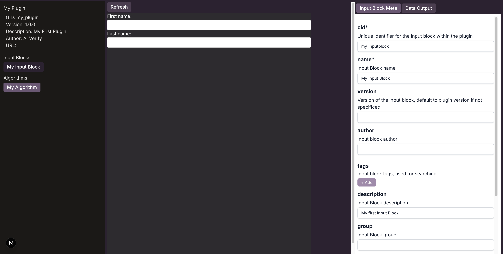

# Creating your First Input Block Component

In this example, you will be building an input block component that prompts the user to enter their first and last name in a web form.

There are three learning objectives in this tutorial:

1. Create a input block component in the plugin project.
2. Modify the input block component to create a web form with inputs for first and last name

## Generating a input block component

Widgets are stored in the **my_plugin/inputs** folder. Use [**aiverify-plugin gib**](../plugins/Plugin_Tool.md#generate-inputblock-alias-gib) to generate your widget.

Run the following command to generate a new input block.

```bash
aiverify-plugin gib "my_inputblock" --name "My Input Block" --description "My first Input Block"
```

Verify that the directory ```inputs``` exists in your current directory with the files for the input block generated inside.

```bash
ls inputs
```

The following files are created:

- my_inputblock.mdx
- my_inputblock.summary.mdx
- my_inputblock.meta.json

## Check the Input Block Meta Data

Open the file `my_inputblock.meta.json` under the **inputs** folder and check that the properties are set correctly as shown below:

```JSON title="my_inputblock.meta.json"
{
  "cid": "my_inputblock",
  "name": "My Input Block",
  "description": "My first Input Block"
}
```

## Editing MDX

Open and edit `my_inputblock.mdx` to implement the MDX content.

```HTML title="my_inputblock.mdx"
<div style={{ display:"flex", flexDirection:"column" }}>
  <label htmlFor="fname">First name:</label>
  <input style={{ color:'black' }} type="text" id="fname" value={props.data["fname"]} onChange={(e)=>props.onChangeData("fname",e.target.value)} />
  <label htmlFor="lname">Last name:</label>
  <input style={{ color:'black' }} type="text" id="lname" value={props.data["lname"]} onChange={(e)=>props.onChangeData("lname",e.target.value)} />
</div>
```

## Editing Summary MDX

Open and edit `my_inputblock.summary.mdx` to update the summary MDX content as highlighted.

```Javascript title="my_inputblock.summary.mdx" linenums="13" hl_lines="6 20"
{/* Return progress in percentage (0-100) */}
export const progress = (data) => {
	// TODO: replace below code with percentage of user completion.
  if (!data)
    return 0;
  const totalKeys = 2;
  const numKeys = Object.values(data).filter(v => {
    if (typeof (v) === "string" || Array.isArray(v)) {
      return v.length > 0;
    } else {
      return true;
    }
  }).length;
  return Math.round((numKeys / totalKeys) * 100);
}

{/* Validate data. */}
export const validate = (data) => {
  // TODO: replace below code with data validation. 
  return true;
}
```

Once you have build your input block, you can proceed to [create a widget](./your_first_widget.md).

## (Optional) Use the **Playground** to view the Input Block.

Run the following command under the plugin directory to launch the [**Playground**](../plugins/widget/Playground.md).

```sh
aiverify-plugin playground
```

Navigate to [http://localhost:5000/InputBlock/my_inputblock](http://localhost:5000/InputBlock/my_inputblock) to view the input block you have created.



Once you make any edit to `my_inputblock.mdx`, you can click the **Refresh** button to view your changes. The `Input Block Meta` tab on the right panel display your Input Block meta information.

Type some characters in the First and Last Name fields, then select the `Data Output` tab on the right panel. You should see the field values captured in the data output.

To exit the Playground, type `ctrl+c` to terminate the application.
