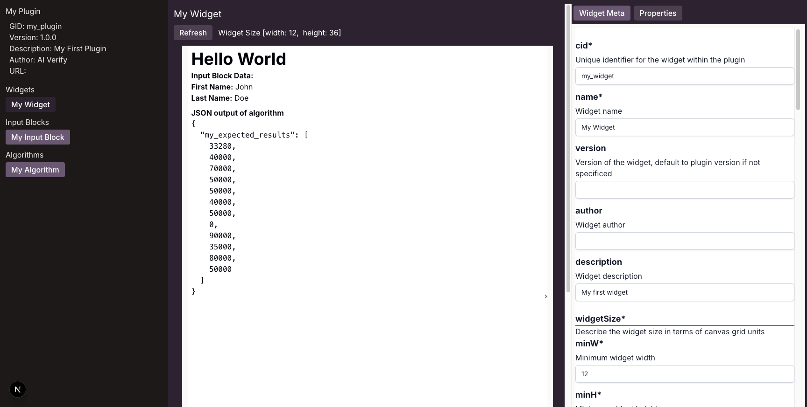
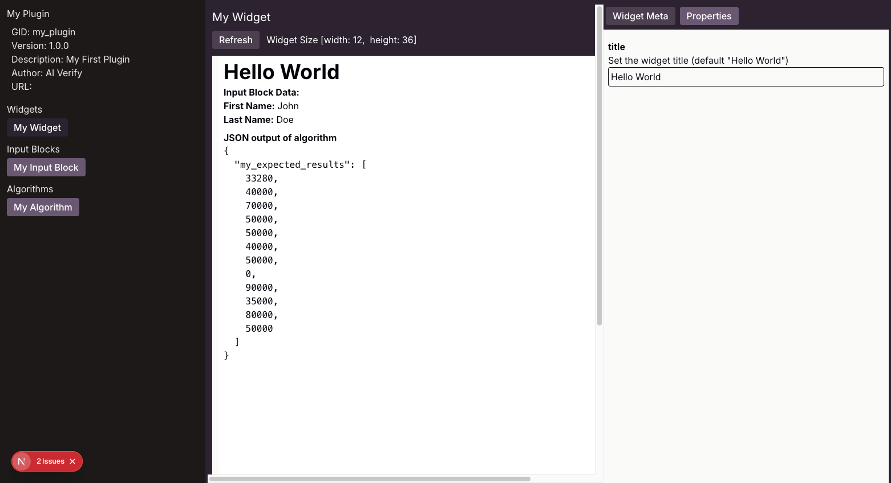

# Creating your First Widget Component

There are three learning objectives in this tutorial:

1. Create a widget component in the existing plugin project.
2. Modify the widget component to display the results from the completed algorithm component
3. Deploy the widget component

## Generating a widget component

Widgets are stored in the **my_plugin/widgets** folder. Use [**aiverify-plugin gw**](../plugins/Plugin_Tool.md#generate-widget-alias-gw) to generate your widget.

Run the following command to generate a new widget and create a dependency to the algorithm and input block components created earlier.

```bash
aiverify-plugin gw "my_widget" --name "My Widget" --description "My first widget" --dep "Algorithm,my_algorithm" --dep "InputBlock,my_inputblock" --minW 12 --dynamicHeight

```

Verify that the directory ```widgets``` exists in your current directory with the files for the widgets generated inside.

```bash
ls widgets
```

The following files are created:

- my_widget.mdx
- my_widget.meta.json
- my_algorithm.sample.json
- my_inputblock.sample.json

## Edit the Widget Meta Data

Open the file `my_widget.meta.json` under the **widgets** folder and add the widget properties are as shown in highlight below below:

```JSON title="my_widget.meta.json" linenums="1" hl_lines="32-38"
{
  "cid": "my_widget",
  "widgetSize": {
    "minW": 12,
    "minH": 1,
    "maxW": 12,
    "maxH": 36
  },
  "name": "My Widget",
  "description": "My first widget",
  "dynamicHeight": true,
  "dependencies": [
    {
      "cid": "my_algorithm"
    },
    {
      "cid": "my_inputblock"
    }
  ],
  "mockdata": [
    {
      "type": "Algorithm",
      "cid": "my_algorithm",
      "datapath": "my_algorithm.sample.json"
    },
    {
      "type": "InputBlock",
      "cid": "my_inputblock",
      "datapath": "my_inputblock.sample.json"
    }
  ],
  "properties": [
    {
      "key": "title",
      "helper": "Set the widget title (default \"Hello World\")",
      "default": "Hello World"
    }
  ]
}
```

## Editing sample algorithm file

Open and edit `my_algorithm.sample.json` with a valid sample output from the algorithm or input block. This sample data will be passed to the MDX component props in the project canvas, and allows the MDX to display data based on sample input.

```JSON title="my_algorithm.sample.json"
{"my_expected_results": [
      33280.0,
      40000.0,
      70000.0,
      50000.0,
      50000.0,
      40000.0,
      50000.0,
      0.0,
      90000.0,
      35000.0,
      80000.0,
      50000.0
  ]    
}
```

## Editing sample input block file

Open and edit `my_inputblock.sample.json` with a valid sample output from the algorithm or input block. This sample data will be passed to the MDX component props in the project canvas, and allows the MDX to display data based on sample input.

```JSON title="my_inputblock.sample.json"
{
  "fname": "John",
  "lname": "Doe"
}
```

## Editing MDX

Open and edit `my_widget.mdx` to implement the MDX content.

```Javascript title="my_widget.mdx"
export const algo_cid = "my_algorithm"
export const ib_cid = "my_inputblock"

# {props.properties.title}

{props.getIBData(ib_cid)?(
  <>
    <b>Input Block Data:</b>
    <p>
      <b>First Name:</b> {props.getIBData(ib_cid)["fname"]}<br/>
      <b>Last Name:</b> {props.getIBData(ib_cid)["lname"]}
    </p>
  </>
):(
  <div>No widget data</div>
)}

{props.getResults(algo_cid)?(
  <>
    <b>JSON output of algorithm</b>
    <pre>{JSON.stringify(props.getResults(algo_cid),null,2)}</pre>
  </>
):(
  <div>No algorithm data</div>
)}
```

Once you are done with the widget creation, you can proceed to [deploy your plugin](./deploy_your_plugin.md).

## (Optional) Use the **Playground** to view the Widget.

Run the following command under the plugin directory to launch the [**Playground**](../plugins/widget/Playground.md).

```sh
aiverify-plugin playground
```

Navigate to [http://localhost:5000/ReportWidget/my_widget](http://localhost:5000/ReportWidget/my_widget) to view the widget you have created.



Once you make any edit to `my_widget.mdx`, you can click the **Refresh** button to view your changes. The `Widget Meta` tab on the right panel display your Widget meta information.

Select the `Properties` tab to see the widget properties defined. Then change the `title` property to other values. Click **Refresh** button to see the widget title updated to the new value you enter.



To exit the Playground, type `ctrl+c` to terminate the application.
