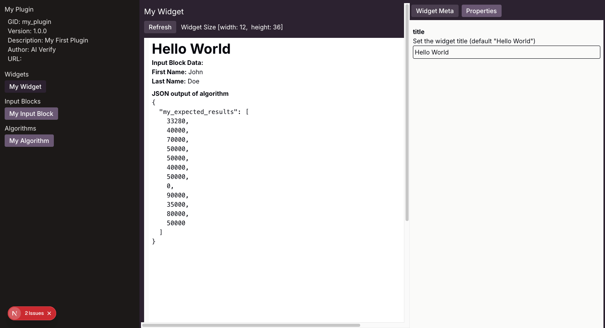

# Using the Playground

The **Playground** provides a UI that allows you to view your **widgets** and **input blocks** before installing to AI Verify.

```sh
$ aiverify-plugin playground --help
aiverify-plugin playground

Launch the plugin playround

Options:
  --help       Show help                                                                    [boolean]
  --pluginDir  Path to plugin directory                                       [string] [default: "."]
  --port       Playground port to listen on                                  [number] [default: 5000]
  --hostname   Playground hostname to listen on                       [string] [default: "localhost"]
```

To launch the playground, run the following command under a Plugin directory.

```sh
aiverify-plugin playground
```

Use your browser to navigate to [http://localhost:5000](http://localhost:5000). You should now be able to access the playground. To listen on another port besides the default port 5000, use the `--port` flag. For example to listen on port 8080,

```sh
$ aiverify-plugin playground --port=8080
Loading playground..
> Playground listening at http://localhost:8080
```

Now you can access the playground from [http://localhost:8080](http://localhost:8080).

## Playground Landing Page


### Menu

The left panel display the plugin meta information as well as the menu bar with list of Widget, Input Block and Algorithm components found under the plugin. You can click on a component to view it.

## Widgets


The widget page center panel displays the widget as it will appears in the Portal canvas. You can update the widget MDX file and then click the **Refresh** button to visualize your changes. Drag the component handle on the right and bottom of the widget to resize the widget.

The **Widget Meta** tab in the right panel displays the widget meta information defined in `<widget cid>.meta.json`.

### Widget Properties


Click on the **Properties** tab on the right panel to view the widget properties defined in the widget meta.

## Input Blocks


The input block page center panel displays the input block component as it will appears in the Portal inputs. You can update the input block MDX file and then click the **Refresh** button to visualize your changes.

The **Input Block Meta** tab in the right panel displays the input block meta information defined in `<input block cid>.meta.json`.

### Input Block Data Output


Click on the **Data Output** tab ib tge right panel to view the JSON data that will be saved in the Portal upon changes to the input block data fields.

## Algorithms


The algorithm page center panel displays algorithm input arguments that will be displayed in the Portal Test Run page. The input arguments are defined in `input.schema.json`. You can update `input.schema.json` and then click the **Refresh** button to visualize the changes.

The **Algorithm Meta** tab in the right panel displays the algorithm meta information defined in `algo.meta.json`.

### Input Schema


Click on the **Input Schema** tab to view the [input schema](../algorithm/file_structure.md#inputschemajson) defined for this algorithm.

### Output Schema


Click on the **Output Schema** tab to view the [output schema](../algorithm/file_structure.md#outputschemajson) defined for this algorithm.

